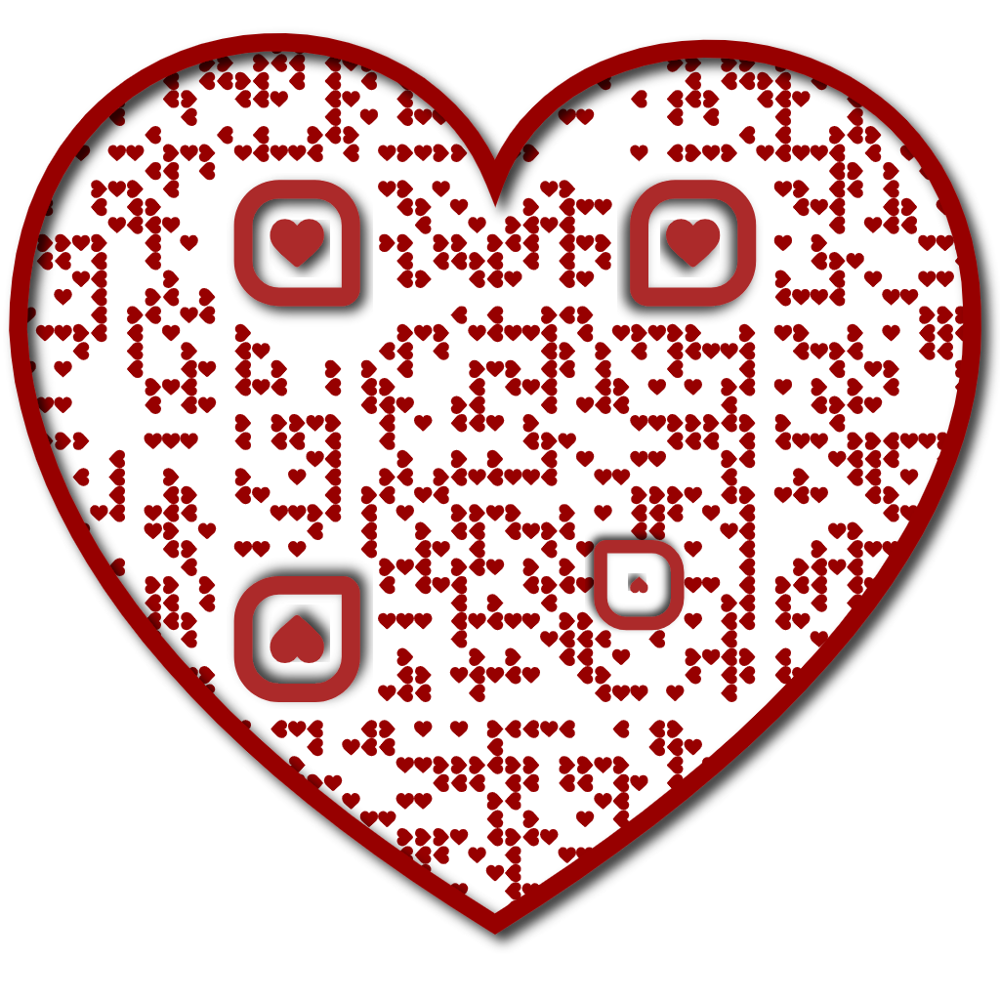

<!DOCTYPE html>
<html lang="en">
<head>
<meta charset="UTF-8" />
<meta name="viewport" content="width=device-width, initial-scale=1.0" />
<title>Happy babii-versary ❤️</title>

</head>
<body>
<h1>Happy babii-versary ❤️</h1>

Progress: Memory Match 🖤 | Maze 🖤

  <button onclick="showGame('memoryGame')">Play Memory Match 🎴</button>
  <button onclick="showGame('mazeGame')">Play Maze 🌀</button>

  
Find all the matching pairs! 🐱🐱

  

  <button onclick="backToMenu()">Back to Game Selection</button>

  
Guide the emoji to the 🏁! Use arrow keys. Watch out for traps and enemies! ✨

  <canvas id="mazeCanvas" width="320" height="320" style="border:2px solid #d4af37"></canvas>
  <button onclick="backToMenu()">Back to Game Selection</button>

🎉 You Win! 🎉

  

  

    
Diagnostics (click to expand)

    
Emoji image status: <strong id="emojiStatus">loading…</strong>

    
Expected emoji path: <code>emoji.png</code>

    
Maze grid: <code>8 × 8</code>, canvas: <code>320 × 320</code>

    
Memory cards: <code>8</code> tiles / 4 pairs

  

<audio autoplay loop>
  <source src="music.mp3" type="audio/mpeg">
</audio>

</body>
</html>
